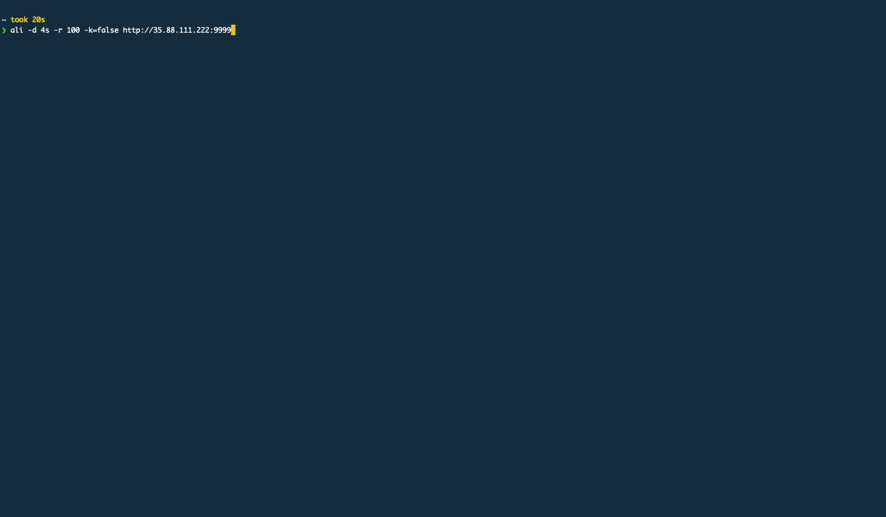
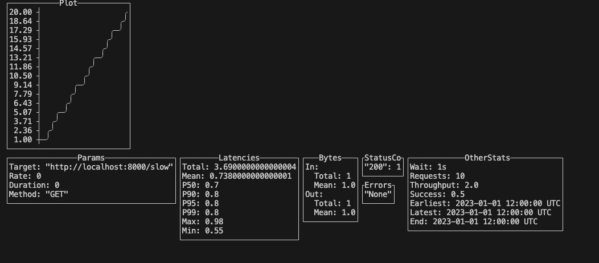

# roebling

Implement a command-line based load testing tool in Haskell that can plot metrics related to latency, request statuses, etc in real time. Our idea is to replicate some of the features of [ali](https://github.com/nakabonne/ali).

# Group Members
- Sumanth R Hegde
- Rohan Mishra
- Raj Nawal
- Om Prakaash

# Features
- Latency Metrics
- Load Testing/Sudden spikes
- Simulate multiple users
- Assess Max load for a given latency target

# Preliminary Design
Our first steps are to break down the project into the following tasks:
- Parsing command-line options
- Generating concurrent requests
- Storage Response results
- Calculate aggregate metrics
- Render UI using `brick` to generate real time plots and metrics.

# Current Progress
## Architecture
We currently have a basic setup to attack a given target endpoint at a given rate for a set number of times. We've replicated command-line arguments for [ali](https://github.com/nakabonne/ali), but haven't implemented all the features yet. There are two key components, each to be run in it's own thread: 
1. Attacker: An [`attacker`](./src/Lib.hs) function that sends a set number of requests to the target endpoint
2. UI: We're using brick widgets to replicate the GUI widgets in ali. Currently, this is static, with dummy data and separated out from the attacking logic. Our plan is to have a channel (from the Concurrency library) where the attacker will dump server responses and the GUI will read in the data and update plots, metrics, etc/
The final UI is supposed to look as follows:

_GUI from [ali](https://github.com/nakabonne/ali)_

Here is our current UI (work in progress):

## Challenges
We're still figuring out how to set up the async logic for communicating between the attacker and the GUI components. Making a plot with brick is a little hard, so we've chosen to dump an ascii chart of the latencies. 

## Goals
We think we can meet our basic goals for the project deadline. Our fallback option at the moment is to display a progress bar and static metrics while the attack happens (still needs communication between threads, but this should be easy) and then finally display a single plot of the latency.

# References
[Ali](https://github.com/nakabonne/ali) - Reference load testing library implemented in Go
[Vegeta](https://github.com/tsenart/vegeta) - Go library implementing Pacer and Attacker modules used in Ali 

# Setup instructions

Head over to [SETUP.md](/SETUP.md) for instructions on build management and running the server.