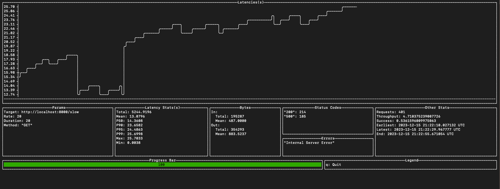

# roebling

A command-line based load testing tool in Haskell that can plot metrics related to latency, request statuses, etc in real time. A minimalistic Haskell implementation of [ali](https://github.com/nakabonne/ali).

# Features
- Pace requests at user-specified rate.
- Support for different request methods, incl. POST with a request body.
- Real-time Latency plot.
- Networking metrics like bytes transferred, latency percentiles, etc.


# Design
- Parse command-line options
- Generate concurrent requests at given pace with a Pacer
- Plot latencies in real-time with a ASCII line chart using `brick`. (Credits: [asciichart](https://github.com/madnight/asciichart)). Resize if needed to fit terminal width.
- Calculate metrics for bytes sent and received, percentiles for latency distribution, statistics for request successes, etc

# Architecture
We have a basic setup to attack a given target endpoint at a given rate for a set number of times with the help of a pacer. We've replicated command-line arguments for [ali](https://github.com/nakabonne/ali), but haven't implemented all the features yet. There are two key components, each to be run in it's own thread: 
1. Attacker: An [`attacker`](./src/Lib.hs) function that sends a set number of requests to the target endpoint
2. UI: We're using brick widgets to replicate the GUI widgets in ali. The core plotting logic for the ASCII line chart has been borrowed from [madnight's asciichart](https://github.com/madnight/asciichart). The attacker dumps server responses into a channel. The GUI listens for updates on it's own channel and updates plots, metrics, etc via Brick's event-handling. We have a simple adapter which connects both the channels together.

The final UI looks as follows:




## Challenges
One of the challenges we faced were to setup the the async logic for pacing requests and communicating between the attacker and the GUI components. Working with an ASCII line chart is also a bit messy. We've had to make a hacky custom widget which monitors the current width of the plot and drops some of the earlier entries from the latency list in order to fit the plot in the terminal's width.

# Setup instructions

## The short version

You'll need to install cabal. Here are the set of commands to run if you want to load test github.com:

```
gh repo clone r2mishra/roebling
cabal install hpack 
hpack
cabal build
cabal run roebling-exe  -- --method GET http://www.github.com/ --rate 20 --duration 30
```
`roebling-exe` takes a number of command line arguments. Here is the currently supported subset:

```
Available options:
  -r,--rate ARG            The request rate per second to issue against the
                           targets. Give 0 then it will send requests as fast as
                           possible. (default: 0)
  -d,--duration ARG        The amount of time to issue requests to the targets.
                           Give 0s for an infinite attack. (default: 0)
  -m,--method ARG          An HTTP request method for each request.
                           (default: "GET")
  -b,--body ARG            A request body to be sent.
  -B,--body-file ARG       The path to file whose content will be set as the
                           http request body.
  target                   The target to attack
```

There are a number of other arguments as well, which you'll see if you do `cabal run roebling-exe  -- -h`. Only the above ones are functional as of 12/15/23.

## The long version

Head over to [SETUP.md](/SETUP.md) for instructions on build management and running the server with Makefile shorthands. 

# Contributors
- Sumanth R Hegde
- Rohan Mishra
- Raj Nawal
- Om Prakaash

# References
- [Ali](https://github.com/nakabonne/ali) - Reference load testing library implemented in Go
- [Vegeta](https://github.com/tsenart/vegeta) - Go library implementing Pacer and Attacker modules used in Ali 
- [Asciichart](https://github.com/madnight/asciichart) - Reference for the core plotting logic. The code for getting a formatted list of strings from a list of latencies is taken from asciichart. We've built on top of this to resize the plot to fit terminal width and also add other widgets.
